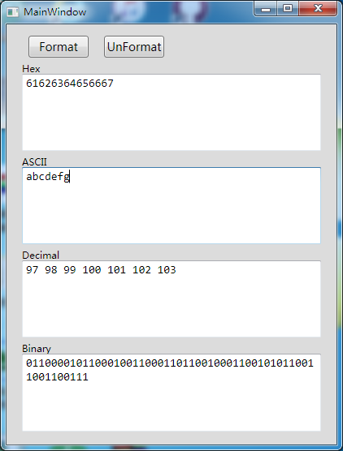
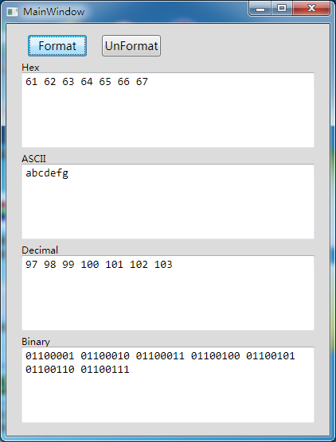

# cat_converter
Text converter, can make conversion between binary, hexadecimal, decimal, ASCII.

这是一个进制转换软件，可以在二进制、十六进制、十进制以及ASCII码之间进行转换，在对应窗格内输入需要转换的数据，其他窗格会自动输出对应进制文本。

This is a converter can make conversion between binary, hexadecimal, decimal, ASCII. Input your data at right textbox, and data in other number system come out at other textboxes automatically.

"Format" 和 "Unformat" 是用来进行文本格式化和取消格式化。格式化效果如下：

"Format" 和 "Unformat" is to format the text or not. Here is the effect of "Format".

这个软件还未完成，存在一些bug，和未实现的功能。

This software is not finished, and now it's working with some bugs, and some of the functions are not implemented yet.
